### 1. Flink任务链和共享组


任务链:

条件：1. one to one 对接 	  2. 并行度相同


共享组：

在代码结束后可以设置参数进行设置

 ```java
 .slotSharingGroup("group_01");
 ```


全局禁用任务链：

```java
env.disableOperatorChaining();
```


任务链：

 1.默认情况

​	所有的算子都是同一个共享组，开启了任务链合并

​    任务所需的slot数据：最大的并行度

​    任务链的个数；

​	  宽依赖、并行度

2. 给算子独立设置了共享组

​     开启了任务链合并

任务所需的slot数据：每个共享组中最大的并行度的和

任务链的个数：宽依赖、并行度、共享组

3.设置全局禁用任务链

​	同一个共享组

​	任务所需的slot数据：最大的并行度的和

​	任务链的个数：算子的个数

4.给某个算子开启新的任务链

​	同一个共享组

​	任务所需的slot数据：最大的并行度的和

​	任务链的个数：宽依赖、并行度、开启了新的任务链

5.给某个算子设置禁用任务链

​	同一个共享组

​	任务所需的slot数据：最大的并行度的和

​	任务链的个数：

​		宽依赖、并行度、禁用任务链的算子


# 一、flink架构

## 1.1、集群模型和角色

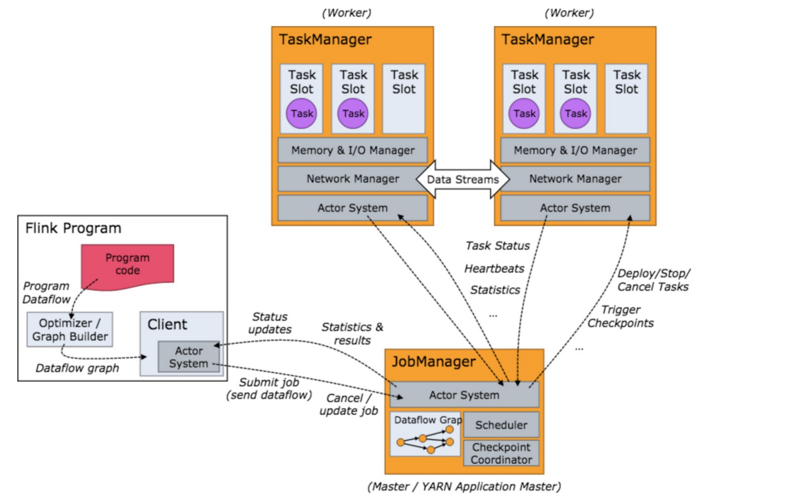

如上图所示：当 Flink 集群启动后，首先会启动一个 JobManger 和一个或多个的 TaskManager。由 Client 提交任务给 JobManager，JobManager 再调度任务到各个 TaskManager 去执行，然后 TaskManager 将心跳和统计信息汇报 给 JobManager。TaskManager 之间以流的形式进行数据的传输。上述三者均为独立的 JVM 进程。 

- Client：

  - 用户在提交编写好的 Flink 工程时，会先创建一个客户端再进行提交，这个客户端就是 Clien。可以是运行在任何机器上（与 JobManager 环境连通即可，一般在跳板机上）。提交 Job 后， Client 可以结束进程，也可以不结束并等待结果返回。
  - Client 会根据用户传入的参数选择使用 yarn per job 模式、stand-alone 模式还是 yarn-session 模式将 Flink 程序提交到集群。 

- JobManager：

  - 集群的管理者，负责调度任务，主要负责从 Client 处接收到 Job 和 JAR 包等资源后，会生成优化后的执行计划，并以 Task 的 单元调度到各个 TaskManager 去执行。
  - 负责调度任务、协调 checkpoints、协调故障恢复、收集 Job 的状态信息，并管理 Flink 集群中的从节点 TaskManager。

- TaskManager ：

- - 实际负责执行计算的 Worker，在其上执行 Flink Job 的一组 Task；TaskManager 还是所在节点的管理员，它负责把该节点上的服务器信息比如内存、磁盘、任务运行情况等向 JobManager 汇报。
  - 在启动的时候就设置好了槽位数（Slot），每个 slot 能启动一个 Task，Task 为线程。从 JobManager 处接收需要部署的 Task，部署启动后，与自己的上游建立 Netty 连接，接收数据并处理。

- flnik架构中的角色间的通信使用Akka（量小，数据大量传输时性能差），数据的传输使用Netty（量大，spark全部使用Netty通信）。

# 二、flink资源和资源组

在flink集群中，一个TaskManager就是一个JVM进程，并且会用独立的线程来执行task，为了控制一个TaskManager能接受多少个task，Flink提出了Task Slot 的概念，

- 我们可以简单的把 Task Slot 理解为 TaskManager 的计算资源子集。假如一个 TaskManager 拥有 5 个 slot，那么该 TaskManager 的计算资源会被平均分为 5 份，不同的 task 在不同的 slot 中执行，避免资源竞争。但是需要注意的是，slot 仅仅用来做内存的隔离，对 CPU 不起作用。

-  通过调整 task slot 的数量，用户可以定义task之间是如何相互隔离的。每个 TaskManager 有一个slot，也就意味 着每个task运行在独立的 JVM 中。每个 TaskManager 有多个slot的话，也就是说多个 task 运行在同一个JVM中。 而在同一个 JVM 进程中的 task，可以共享 TCP 连接（基于多路复用）和心跳消息，可以减少数据的网络传输。也能 共享一些数据结构，一定程度上减少了每个task的消耗。

## 2.1、task的并行度

```scala
val wordCount2: DataStream[(String, Int)] = socket.flatMap(new FlatMapFunction[String, (String, Int)] {
      override def flatMap(int: String, out: Collector[(String, Int)]): Unit = {
        val strings: Array[String] = int.split(" ")
        for (str <- strings) {
          out.collect((str, 1))
        }
      }
    }).setParallelism(2) // 设置task的并行度/槽数
      .keyBy(_._1).sum(1).setParallelism(2)
```


**通过job的webUI界面查看任务的并行度**

 **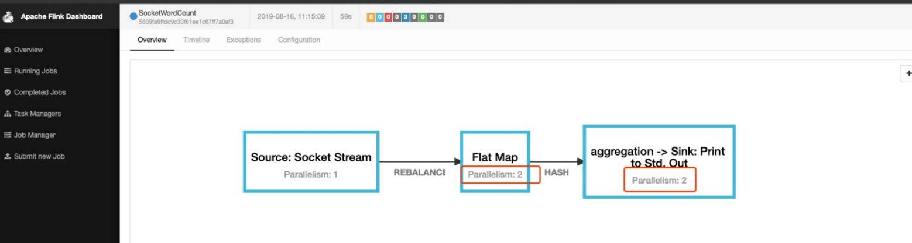**

## 2.2、Operator Chains 

为了更高效地分布式执行，Flink 会尽可能地将 operator 的 subtask 链接（chain）在一起形成 task。每个 task 在一个 线程中执行。将 operators 链接成 task 是非常有效的优化：

- 它能减少线程之间的切换；
- 减少消息的序列化/反序列化；
- 减少数据在缓冲区的交换；
- 减少了延迟的同时提高整体的吞吐量。 

以下面的 WordCount 为例，下面这幅图，展示了Source并行度为1，FlatMap、KeyAggregation、Sink并 行度均为2，最终以5个并行的线程来执行的优化过程。 

 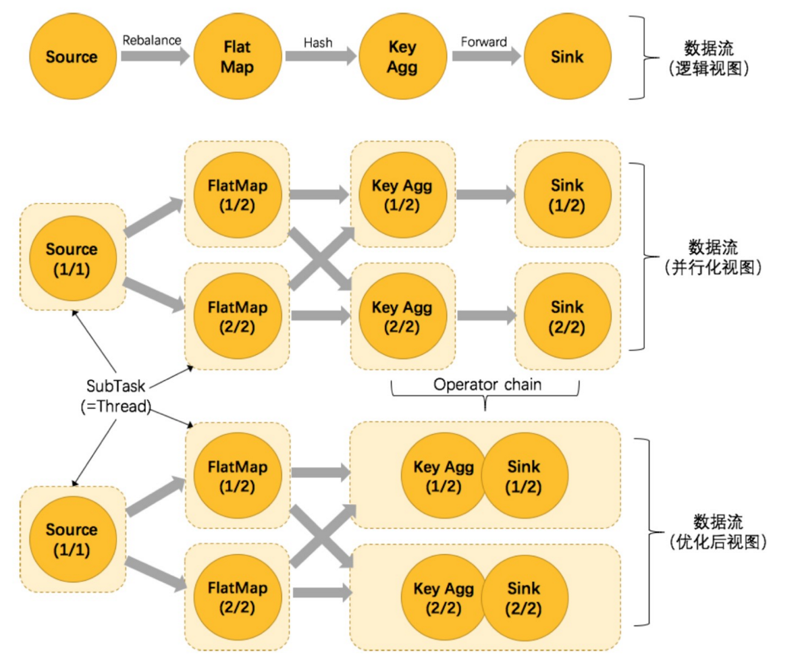

上图中将KeyAggregation和Sink两个operator进行了合并，因为这两个合并后并不会改变整体的拓扑结构。但是，并不是任意两个 operator 就能 chain 一起的。其条件还是很苛刻的： 

1. 上下游的并行度一致（槽一致）。
2. 下游节点的入度为1 （也就是说下游节点没有来自其他节点的输入） 。
3. 上下游节点都在同一个 slot group 中。 
4. 下游节点的 chain 策略为 ALWAYS（可以与上下游链接，map、flatmap、filter等默认是ALWAYS） 。
5. 上游节点的 chain 策略为 ALWAYS 或 HEAD（只能与下游链接，不能与上游链接，Source默认是HEAD） 。
6. 上下游算子之间没有数据shuffle (数据分区方式是 forward) 。
7. 用户没有禁用 chain。 

Operator chain的行为可以通过编程API中进行指定。可以通过在DataStream的operator后面（如 someStream.map(..))调用startNewChain()来指示从该operator开始一个新的chain（与前面截断，不会被chain到 前面）。或者调用disableChaining()来指示该operator不参与chaining（不会与前后的operator chain一起）。在底层，这两个方法都是通过调整operator的 chain 策略（HEAD、NEVER）来实现的。另外，也可以通过调用 StreamExecutionEnvironment.disableOperatorChaining()来全局禁用chaining。

[](javascript:void(0);)

```java
/*
 * Licensed to the Apache Software Foundation (ASF) under one
 * or more contributor license agreements.  See the NOTICE file
 * distributed with this work for additional information
 * regarding copyright ownership.  The ASF licenses this file
 * to you under the Apache License, Version 2.0 (the
 * "License"); you may not use this file except in compliance
 * with the License.  You may obtain a copy of the License at
 *
 *     http://www.apache.org/licenses/LICENSE-2.0
 *
 * Unless required by applicable law or agreed to in writing, software
 * distributed under the License is distributed on an "AS IS" BASIS,
 * WITHOUT WARRANTIES OR CONDITIONS OF ANY KIND, either express or implied.
 * See the License for the specific language governing permissions and
 * limitations under the License.
 */

package org.apache.flink.streaming.api.operators;

import org.apache.flink.annotation.PublicEvolving;

/**
 * Defines the chaining scheme for the operator. When an operator is chained to the
 * predecessor, it means that they run in the same thread. They become one operator
 * consisting of multiple steps.
 *
 * <p>The default value used by the StreamOperator is {@link #HEAD}, which means that
 * the operator is not chained to its predecessor. Most operators override this with
 * {@link #ALWAYS}, meaning they will be chained to predecessors whenever possible.
 */
@PublicEvolving
public enum ChainingStrategy {

    /**
     * Operators will be eagerly chained whenever possible.
     *
     * <p>To optimize performance, it is generally a good practice to allow maximal
     * chaining and increase operator parallelism.
     */
    ALWAYS,

    /**
     * The operator will not be chained to the preceding or succeeding operators.
     */
    NEVER,

    /**
     * The operator will not be chained to the predecessor, but successors may chain to this
     * operator.
     */
    HEAD
}
```

[](javascript:void(0);)

**代码验证：** 

- operator禁用chaining
  - 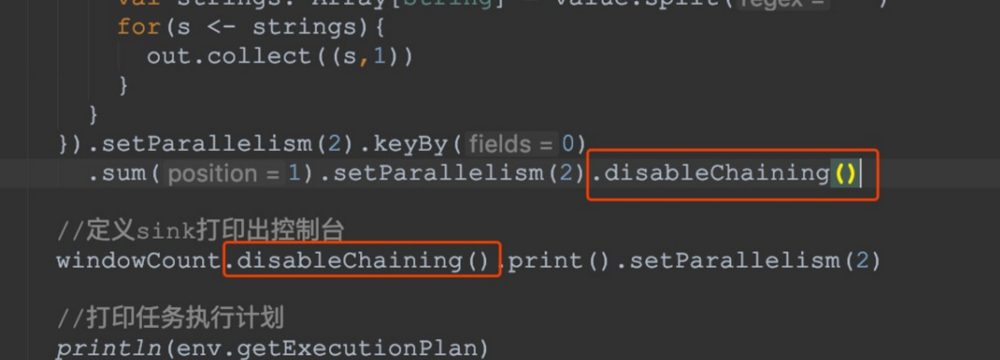

- 全局禁用chaining 
  - 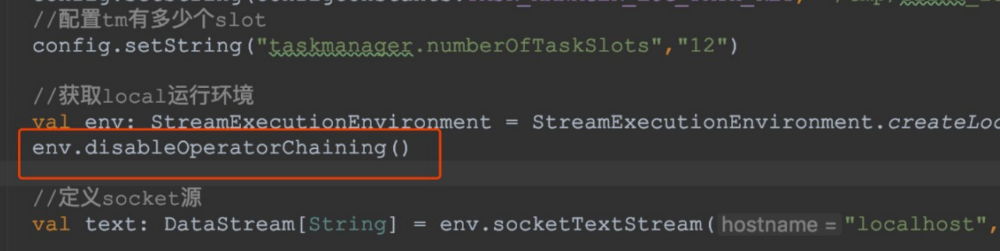 

- 查看job的graph图 
  - 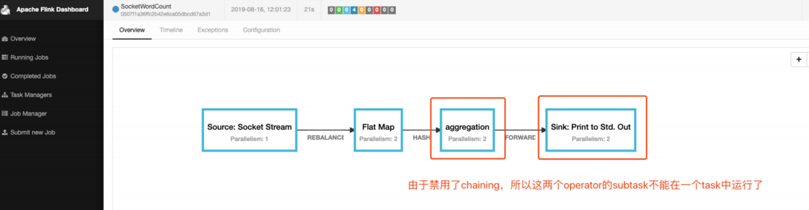 

**原理与实现：**

那么 Flink 是如何将多个 operators chain在一起的呢？chain在一起的operators是如何作为一个整体被执行的呢？ 它们之间的数据流又是如何避免了序列化/反序列化以及网络传输的呢？下图展示了operators chain的内部实现：

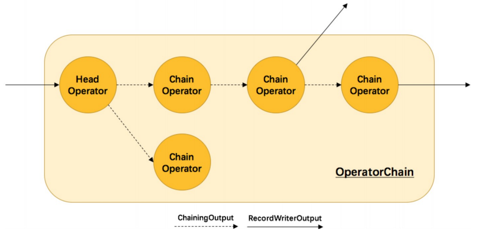

如上图所示，Flink内部是通过OperatorChain这个类来将多个operator链在一起形成一个新的operator。
OperatorChain形成的框框就像一个黑盒，Flink 无需知道黑盒中有多少个ChainOperator、数据在chain内部是怎么 流动的，只需要将input数据交给 HeadOperator 就可以了，这就使得OperatorChain在行为上与普通的operator无 差别，上面的OperaotrChain就可以看做是一个入度为1，出度为2的operator。所以在实现中，对外可见的只有 HeadOperator，以及与外部连通的实线输出，这些输出对应了JobGraph中的JobEdge，在底层通过 RecordWriterOutput来实现。另外，框中的虚线是operator chain内部的数据流，这个流内的数据不会经过序列化/ 反序列化、网络传输，而是直接将消息对象传递给下游的 ChainOperator 处理，这是性能提升的关键点，在底层 是通过 ChainingOutput 实现的

##  2.3、SlotSharingGroup 与 CoLocationGroup 

Flink 允许将不能形成算子链的两个操作，比如下图中的 flatmap 和 key&sink 放在一个 TaskSlot 里执行以达到资源共享的目的。

每一个 TaskManager 会拥有一个或多个的 task slot，每个 slot 都能跑由多个连续 task 组成的一个 pipeline。

如上文所述的 WordCount 例子，5个Task没有solt共享的时候在TaskManager的slots中如下图分布，2个 TaskManager，每个有3个slot：

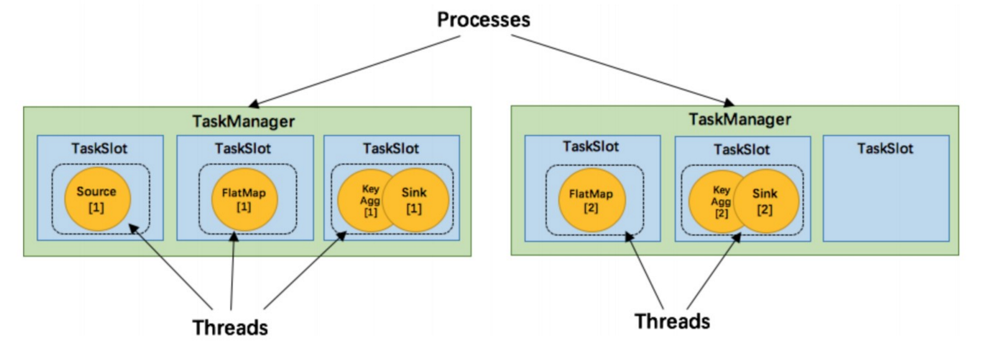

默认情况下，Flink 允许subtasks共享slot，条件是它们都来自同一个Job的不同task的subtask。结果可能一个slot 持有该job的整个pipeline。允许slot共享有以下两点好处：

1. Flink 集群所需的task slots数与 job 中最高的并行度一致。
2. 更容易获得更充分的资源利用。如果没有slot共享，那么非密集型操作 source/flatmap 就会占用同密集型操作 keyAggregation/sink 一样多的资源。如果有slot共享，将基线的2个并行度增加到6个，能充分利用slot资源， 同时保证每个TaskManager能平均分配到相同数量的subtasks。

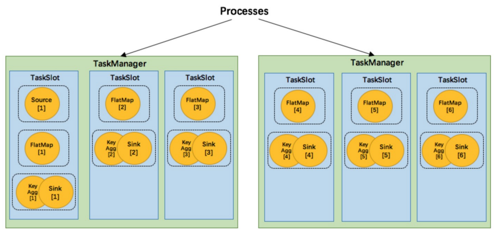

我们将 WordCount 的并行度从之前的2个增加到6个（Source并行度仍为1），并开启slot共享（所有operator都在 default共享组），将得到如上图所示的slot分布图。该任务最终会占用6个slots（最高并行度为6）。其次，我们可 以看到密集型操作 keyAggregation/sink 被平均地分配到各个 TaskManager。

**SlotSharingGroup：** 

- SlotSharingGroup 是 Flink 中用来实现slot共享的类，它尽可能地让subtasks共享一个slot。 
- 保证同一个group的并行度相同的sub-tasks 共享同一个slots 
- 算子的默认 group 为 default（即默认一个job下的subtask都可以共享一个slot） 
- 为了防止不合理的共享，用户也能通过 API 来强制指定 operator 的共享组，比如： someStream.filter(...).slotSharingGroup("group1")；就强制指定了 filter 的 slot 共享组为 group1。 
- 怎么确定一个未做 SlotSharingGroup 设置的算子的 Group 是什么呢（根据上游算子的 group 和自身是否设置 group 共同确定） 
- 适当设置可以减少每个 slot 运行的线程数，从而整体上减少机器的负载 CoLocationGroup(强制)

**CoLocationGroup(强制)：**

- 保证所有的并行度相同的sub-tasks运行在同一个slot 
- 主要用于迭代流(训练机器学习模型) 

**代码验证：**

- 设置本地开发环境的slot数量
  - 
  - 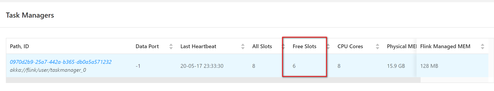
-  设置最后的 operator 使用新的 group
  - 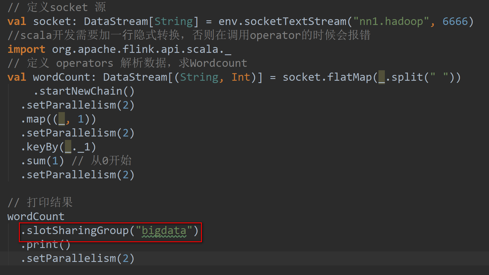
  - 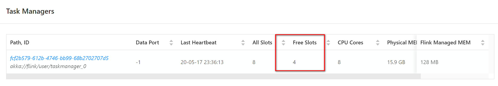
- 为什么占用了两个呢？
  - 因为不同组，与上面的default不能共享slot，**组间互斥。**
  - 同组中的同一个 operator 的 subtask 不能在一个 slot 中，由于 operator 的并行度是 2，所以占用了两个槽 位，**组内互斥。**

**原理与实现：**

那么多个 tasks（或者说 operators ）是如何共享 slot 的呢？
我们先来看一下用来定义计算资源的slot的类图：

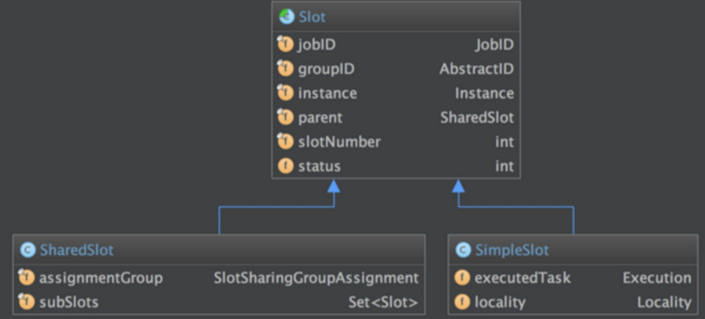

抽象类 Slot 定义了该槽位属于哪个 TaskManager（instance）的第几个槽位（slotNumber），属于哪个 Job（jobID）等信息。最简单的情况下，一个 slot 只持有一个task，也就是 SimpleSlot 的实现。复杂点的情况，一 个 slot 能共享给多个task使用，也就是 SharedSlot 的实现。

 

接下来我们来看看 Flink 为subtask分配slot的过程。关于Flink调度，有两个非常重要的原则我们必须知道：

1. 同一个 operator 的各个 subtask 是不能呆在同一个 SharedSlot 中的，例如 FlatMap[1] 和 FlatMap[2] 是不能在同一 个 SharedSlot 中的。
2. Flink 是按照拓扑顺序从 Source 一个个调度到 Sink 的。例如 WordCount（Source并行度为1，其他并行度为 2），那么调度的顺序依次是：Source -> FlatMap[1] -> FlatMap[2] -> KeyAgg->Sink[1] -> KeyAgg- >Sink[2]。假设现在有2个 TaskManager，每个只有1个slot（为简化问题），那么分配slot的过程如图所示：

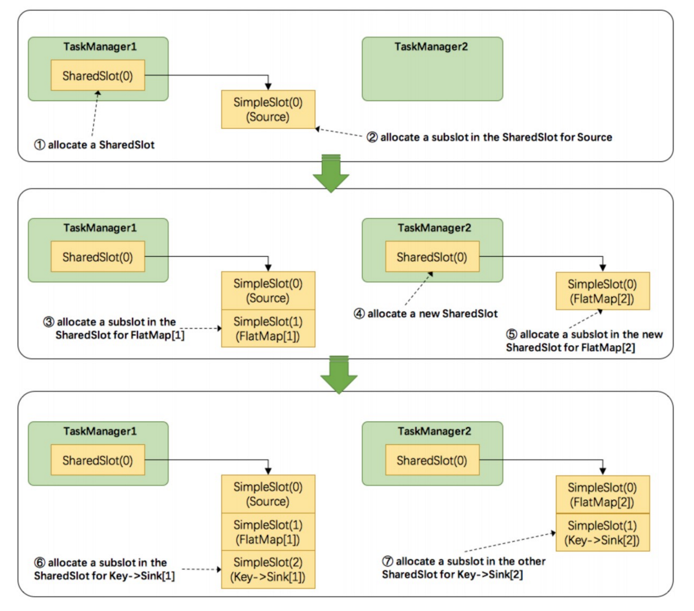

注：图中 SharedSlot 与 SimpleSlot 后带的括号中的数字代表槽位号（slotNumber）

1. 为Source分配slot。首先，我们从TaskManager1中分配出一个SharedSlot。并从SharedSlot中为Source分配 出一个SimpleSlot。如上图中的①和②。
2. 为FlatMap[1]分配slot。目前已经有一个SharedSlot，则从该SharedSlot中分配出一个SimpleSlot用来部署 FlatMap[1]。如上图中的③。
3. 为FlatMap[2]分配slot。由于TaskManager1的SharedSlot中已经有同operator的FlatMap[1]了，我们只能分配 到其他SharedSlot中去。从TaskManager2中分配出一个SharedSlot，并从该SharedSlot中为FlatMap[2]分配 出一个SimpleSlot。如上图的④和⑤。
4. 为Key->Sink[1]分配slot。目前两个SharedSlot都符合条件，从TaskManager1的SharedSlot中分配出一个 SimpleSlot用来部署Key->Sink[1]。如上图中的⑥。
5. 为Key->Sink[2]分配slot。TaskManager1的SharedSlot中已经有同operator的Key->Sink[1]了，则只能选择另 一个SharedSlot中分配出一个SimpleSlot用来部署Key->Sink[2]。如上图中的⑦。

最后Source、FlatMap[1]、Key->Sink[1]这些subtask都会部署到TaskManager1的唯一一个slot中，并启动对应的 线程。FlatMap[2]、Key->Sink[2]这些subtask都会被部署到TaskManager2的唯一一个slot中，并启动对应的线 程。从而实现了slot共享。

 

Flink中计算资源的相关概念以及原理实现。最核心的是 Task Slot，每个slot能运行一个或多个task。为了拓扑更高 效地运行，Flink提出了Chaining，尽可能地将operators chain在一起作为一个task来处理。为了资源更充分的利 用，Flink又提出了SlotSharingGroup，尽可能地让多个task共享一个slot。

**如何计算一个应用需要多少slot：**

- 不设置 SlotSharingGroup 时是应用的最大并行度，此时只有一个 default 组。
- 设置 SlotSharingGroup 时所有 SlotSharingGroup 中的最大并行度之和。

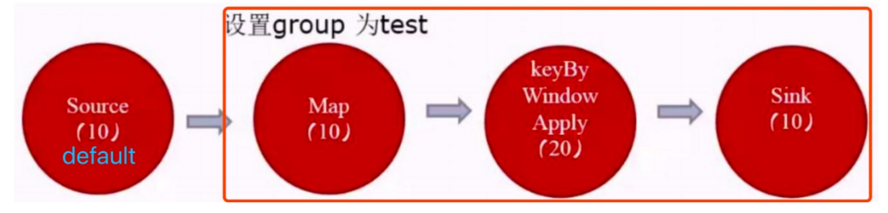

由于 source 和 map 之后的 operator 不属于同一个 group ，所以 source 和它们不能在一个 solt 中运行，而这里的 source 的 default 组的并行度是10，test 组的并行度是20，所以所需槽位一共是30


# 三 、执行模式


Flink从`1.12.0`上对`流式API`新增一项特性:可以根据你的使用情况和Job的特点, 可以选择不同的运行时执行模式(runtime execution modes).
 流式API的传统执行模式我们称之为`STREAMING` 执行模式, 这种模式一般用于无界流, 需要持续的在线处理
 1.12.0新增了一个`BATCH`执行模式, 这种执行模式在执行方式上类似于MapReduce框架. 这种执行模式一般用于有界数据.
 默认是使用的`STREAMING` 执行模式

## 选择执行模式

`BATCH`执行模式`仅仅用于有界数据`, 而`STREAMING` 执行模式可以用在`有界数据和无界数据`.
 一个公用的规则就是: 当你处理的数据是`有界`的就应该`使用BATCH执行模式`, 因为它更加高效. 当你的数据是`无界`的, 则必须`使用STREAMING 执行模式`, 因为只有这种模式才能处理持续的数据流.

## 配置BATH执行模式

执行模式有3个选择可配:

1. STREAMING(默认)：有界数据和无界数据
2. BATCH：有界数据
3. AUTOMATIC：自动进行选择执行模式

## 传统的方式：

1. 批处理：

```java
// 获取环境
ExecutionEnvironment executionEnvironment = ExecutionEnvironment.getExecutionEnvironment();

// 读取资源
DataSource<String> dataSource = executionEnvironment.readTextFile("文件地址");
```

1. 有界流


```dart
StreamExecutionEnvironment env= StreamExecutionEnvironment.getExecutionEnvironment();

// 读取资源
DataStreamSource<String> streamSource = env.readTextFile("文件地址");

env.execute();
```

1. 无界流


```dart
StreamExecutionEnvironment env = StreamExecutionEnvironment.getExecutionEnvironment();

// 监听端口
DataStreamSource<String> source = env.socketTextStream("hadoop102", 9999)

env.execute();
```

批处理与流处理的区别：

1. 批处理处理数据，是一批一批对数据处理，spark就是一个微批数据处理引擎，可以理解成先对数据积压，然后达到一定量再一块处理。
2. 流处理，有数据就处理，不需要积压数据
3. 批处理无需保留数据状态，处理完就输出。
4. 流处理需要保留数据状态，因为也有可能还有该数据。
5. 批处理完成，程序就停止。
6. 流处理，需要一直等待，即使后面不会有数据产生，程序依然保存运行状态。

有界与无界的理解：

> 有界流与无界流的区别在于读取的数据是否有尽头，若读取的数据类似于文件（知道开始的位置，结束的位置），无界流就是知道开始但不知道什么时候结束，如网络，Kafka，需要不同的监听着，等待处理数据。

# 案例（wordcount)

## 流式处理

程序比较简单，就没加注释


```dart
    @Test
    public void wordCount1() throws Exception {
        StreamExecutionEnvironment env = StreamExecutionEnvironment.getExecutionEnvironment();

        DataStreamSource<String> source = env.readTextFile("D:\\project\\idea\\flink\\input\\wordcount.txt");

        SingleOutputStreamOperator<Tuple2<String, Integer>> flatMap = source.flatMap((FlatMapFunction<String, Tuple2<String, Integer>>) (value, out)
                -> Arrays.stream(value.split(" "))
                .forEach(s -> out.collect(Tuple2.of(s, 1)))).returns(Types.TUPLE(Types.STRING, Types.INT));

        SingleOutputStreamOperator<Tuple2<String, Integer>> result = flatMap.keyBy(e -> e.f0).sum(1);

        result.print();

        env.execute();
    }
```

结果


```bash
5> (python,1)
12> (word,1)
3> (java,1)
13> (xml,1)
1> (pon,1)
11> (log,1)
7> (txt,1)
1> (pon,2)
11> (exe,1)
3> (java,2)
11> (log,2)
5> (python,2)
5> (hello,1)
5> (python,3)
5> (hello,2)
3> (java,3)
13> (xml,2)
14> (count,1)
11> (log,3)
13> (xml,3)
14> (batch,1)
```

## 批处理


```dart
    @Test
    public void wordCount2() throws Exception {

        ExecutionEnvironment env = ExecutionEnvironment.getExecutionEnvironment();
        // 和流式处理，是两套完全不同的api
        DataSource<String> source = env.readTextFile("D:\\project\\idea\\flink\\input\\wordcount.txt");

        FlatMapOperator<String, Tuple2<String, Integer>> flatMap = source.flatMap((FlatMapFunction<String, Tuple2<String, Integer>>) (value, out)
                -> Arrays.stream(value.split(" "))
                .forEach(s -> out.collect(Tuple2.of(s, 1)))).returns(Types.TUPLE(Types.STRING, Types.INT));

        AggregateOperator<Tuple2<String, Integer>> result = flatMap.groupBy(0).sum(1);

        result.print();
    }
```

结果


```bash
(pon,2)
(hello,2)
(log,3)
(xml,3)
(exe,1)
(java,3)
(python,3)
(txt,1)
(batch,1)
(count,1)
(word,1)
```

## 设置执行模式

> 传统上的批处理和流处理，需要两套不同的API来处理，不太符合Flink中`流批一体`的理念，此时执行模式的出现完美的解决了问题。只需要指定一个`执行模式`，就可以完成`流与批`之间的相互转换，其他代码都不用修改。

执行模式所支持的模式：


```dart
@PublicEvolving
public enum RuntimeExecutionMode {

    /**
     * The Pipeline will be executed with Streaming Semantics. All tasks will be deployed before
     * execution starts, checkpoints will be enabled, and both processing and event time will be
     * fully supported.
     */
    STREAMING,

    /**
     * The Pipeline will be executed with Batch Semantics. Tasks will be scheduled gradually based
     * on the scheduling region they belong, shuffles between regions will be blocking, watermarks
     * are assumed to be "perfect" i.e. no late data, and processing time is assumed to not advance
     * during execution.
     */
    BATCH,

    /**
     * Flink will set the execution mode to {@link RuntimeExecutionMode#BATCH} if all sources are
     * bounded, or {@link RuntimeExecutionMode#STREAMING} if there is at least one source which is
     * unbounded.
     */
    AUTOMATIC
}
```

转换成批处理


```dart
    @Test
    public void wordCount1() throws Exception {
        StreamExecutionEnvironment env = StreamExecutionEnvironment.getExecutionEnvironment();
        // 转成批处理，其他都不用改
        env.setRuntimeMode(RuntimeExecutionMode.BATCH);

        DataStreamSource<String> source = env.readTextFile("D:\\project\\idea\\flink\\input\\wordcount.txt");

        SingleOutputStreamOperator<Tuple2<String, Integer>> flatMap = source.flatMap((FlatMapFunction<String, Tuple2<String, Integer>>) (value, out)
                -> Arrays.stream(value.split(" "))
                .forEach(s -> out.collect(Tuple2.of(s, 1)))).returns(Types.TUPLE(Types.STRING, Types.INT));

        SingleOutputStreamOperator<Tuple2<String, Integer>> result = flatMap.keyBy(e -> e.f0).sum(1);

        result.print();

        env.execute();
    }
```

结果


```bash
1> (pon,2)
5> (hello,2)
5> (python,3)
3> (java,3)
7> (txt,1)
14> (batch,1)
14> (count,1)
13> (xml,3)
11> (exe,1)
11> (log,3)
12> (word,1)
```

注意：

1. 在13版本之前不要使用`执行模式`，若数据只有一个(如： (txt,1)），那么该数据不会被输出，13版本修复了该问题。
2. 批处理不会存状态（处理完就直接输出了，所以没有必要保留状态）

