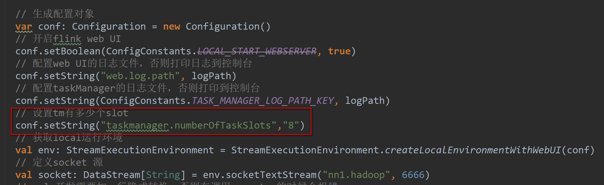

### 1. Flink任务链和共享组


任务链:

条件：1. one to one 对接 	  2. 并行度相同


共享组：

在代码结束后可以设置参数进行设置

 ```java
 .slotSharingGroup("group_01");
 ```


全局禁用任务链：

```java
env.disableOperatorChaining();
```


任务链：

 1.默认情况

​	所有的算子都是同一个共享组，开启了任务链合并

​    任务所需的slot数据：最大的并行度

​    任务链的个数；

​	  宽依赖、并行度

2. 给算子独立设置了共享组

​     开启了任务链合并

任务所需的slot数据：每个共享组中最大的并行度的和

任务链的个数：宽依赖、并行度、共享组

3.设置全局禁用任务链

​	同一个共享组

​	任务所需的slot数据：最大的并行度的和

​	任务链的个数：算子的个数

4.给某个算子开启新的任务链

​	同一个共享组

​	任务所需的slot数据：最大的并行度的和

​	任务链的个数：宽依赖、并行度、开启了新的任务链

5.给某个算子设置禁用任务链

​	同一个共享组

​	任务所需的slot数据：最大的并行度的和

​	任务链的个数：

​		宽依赖、并行度、禁用任务链的算子


# 一、flink架构

## 1.1、集群模型和角色


如上图所示：当 Flink 集群启动后，首先会启动一个 JobManger 和一个或多个的 TaskManager。由 Client 提交任务给 JobManager，JobManager 再调度任务到各个 TaskManager 去执行，然后 TaskManager 将心跳和统计信息汇报 给 JobManager。TaskManager 之间以流的形式进行数据的传输。上述三者均为独立的 JVM 进程。 

- Client：

  - 用户在提交编写好的 Flink 工程时，会先创建一个客户端再进行提交，这个客户端就是 Clien。可以是运行在任何机器上（与 JobManager 环境连通即可，一般在跳板机上）。提交 Job 后， Client 可以结束进程，也可以不结束并等待结果返回。
  - Client 会根据用户传入的参数选择使用 yarn per job 模式、stand-alone 模式还是 yarn-session 模式将 Flink 程序提交到集群。 

- JobManager：

  - 集群的管理者，负责调度任务，主要负责从 Client 处接收到 Job 和 JAR 包等资源后，会生成优化后的执行计划，并以 Task 的 单元调度到各个 TaskManager 去执行。
  - 负责调度任务、协调 checkpoints、协调故障恢复、收集 Job 的状态信息，并管理 Flink 集群中的从节点 TaskManager。

- TaskManager ：

- - 实际负责执行计算的 Worker，在其上执行 Flink Job 的一组 Task；TaskManager 还是所在节点的管理员，它负责把该节点上的服务器信息比如内存、磁盘、任务运行情况等向 JobManager 汇报。
  - 在启动的时候就设置好了槽位数（Slot），每个 slot 能启动一个 Task，Task 为线程。从 JobManager 处接收需要部署的 Task，部署启动后，与自己的上游建立 Netty 连接，接收数据并处理。

- flnik架构中的角色间的通信使用Akka（量小，数据大量传输时性能差），数据的传输使用Netty（量大，spark全部使用Netty通信）。

# 二、flink资源和资源组

在flink集群中，一个TaskManager就是一个JVM进程，并且会用独立的线程来执行task，为了控制一个TaskManager能接受多少个task，Flink提出了Task Slot 的概念，

- 我们可以简单的把 Task Slot 理解为 TaskManager 的计算资源子集。假如一个 TaskManager 拥有 5 个 slot，那么该 TaskManager 的计算资源会被平均分为 5 份，不同的 task 在不同的 slot 中执行，避免资源竞争。但是需要注意的是，slot 仅仅用来做内存的隔离，对 CPU 不起作用。

-  通过调整 task slot 的数量，用户可以定义task之间是如何相互隔离的。每个 TaskManager 有一个slot，也就意味 着每个task运行在独立的 JVM 中。每个 TaskManager 有多个slot的话，也就是说多个 task 运行在同一个JVM中。 而在同一个 JVM 进程中的 task，可以共享 TCP 连接（基于多路复用）和心跳消息，可以减少数据的网络传输。也能 共享一些数据结构，一定程度上减少了每个task的消耗。

## 2.1、task的并行度

```scala
val wordCount2: DataStream[(String, Int)] = socket.flatMap(new FlatMapFunction[String, (String, Int)] {
      override def flatMap(int: String, out: Collector[(String, Int)]): Unit = {
        val strings: Array[String] = int.split(" ")
        for (str <- strings) {
          out.collect((str, 1))
        }
      }
    }).setParallelism(2) // 设置task的并行度/槽数
      .keyBy(_._1).sum(1).setParallelism(2)
```


**通过job的webUI界面查看任务的并行度**

 ****

## 2.2、Operator Chains 

为了更高效地分布式执行，Flink 会尽可能地将 operator 的 subtask 链接（chain）在一起形成 task。每个 task 在一个 线程中执行。将 operators 链接成 task 是非常有效的优化：

- 它能减少线程之间的切换；
- 减少消息的序列化/反序列化；
- 减少数据在缓冲区的交换；
- 减少了延迟的同时提高整体的吞吐量。 

以下面的 WordCount 为例，下面这幅图，展示了Source并行度为1，FlatMap、KeyAggregation、Sink并 行度均为2，最终以5个并行的线程来执行的优化过程。 

 

上图中将KeyAggregation和Sink两个operator进行了合并，因为这两个合并后并不会改变整体的拓扑结构。但是，并不是任意两个 operator 就能 chain 一起的。其条件还是很苛刻的： 

1. 上下游的并行度一致（槽一致）。
2. 下游节点的入度为1 （也就是说下游节点没有来自其他节点的输入） 。
3. 上下游节点都在同一个 slot group 中。 
4. 下游节点的 chain 策略为 ALWAYS（可以与上下游链接，map、flatmap、filter等默认是ALWAYS） 。
5. 上游节点的 chain 策略为 ALWAYS 或 HEAD（只能与下游链接，不能与上游链接，Source默认是HEAD） 。
6. 上下游算子之间没有数据shuffle (数据分区方式是 forward) 。
7. 用户没有禁用 chain。 

Operator chain的行为可以通过编程API中进行指定。可以通过在DataStream的operator后面（如 someStream.map(..))调用startNewChain()来指示从该operator开始一个新的chain（与前面截断，不会被chain到 前面）。或者调用disableChaining()来指示该operator不参与chaining（不会与前后的operator chain一起）。在底层，这两个方法都是通过调整operator的 chain 策略（HEAD、NEVER）来实现的。另外，也可以通过调用 StreamExecutionEnvironment.disableOperatorChaining()来全局禁用chaining。

[](javascript:void(0);)

```java
/*
 * Licensed to the Apache Software Foundation (ASF) under one
 * or more contributor license agreements.  See the NOTICE file
 * distributed with this work for additional information
 * regarding copyright ownership.  The ASF licenses this file
 * to you under the Apache License, Version 2.0 (the
 * "License"); you may not use this file except in compliance
 * with the License.  You may obtain a copy of the License at
 *
 *     http://www.apache.org/licenses/LICENSE-2.0
 *
 * Unless required by applicable law or agreed to in writing, software
 * distributed under the License is distributed on an "AS IS" BASIS,
 * WITHOUT WARRANTIES OR CONDITIONS OF ANY KIND, either express or implied.
 * See the License for the specific language governing permissions and
 * limitations under the License.
 */

package org.apache.flink.streaming.api.operators;

import org.apache.flink.annotation.PublicEvolving;

/**
 * Defines the chaining scheme for the operator. When an operator is chained to the
 * predecessor, it means that they run in the same thread. They become one operator
 * consisting of multiple steps.
 *
 * <p>The default value used by the StreamOperator is {@link #HEAD}, which means that
 * the operator is not chained to its predecessor. Most operators override this with
 * {@link #ALWAYS}, meaning they will be chained to predecessors whenever possible.
 */
@PublicEvolving
public enum ChainingStrategy {

    /**
     * Operators will be eagerly chained whenever possible.
     *
     * <p>To optimize performance, it is generally a good practice to allow maximal
     * chaining and increase operator parallelism.
     */
    ALWAYS,

    /**
     * The operator will not be chained to the preceding or succeeding operators.
     */
    NEVER,

    /**
     * The operator will not be chained to the predecessor, but successors may chain to this
     * operator.
     */
    HEAD
}
```

[](javascript:void(0);)

**代码验证：** 

- operator禁用chaining
  - 

- 全局禁用chaining 
  -  

- 查看job的graph图 
  -  

**原理与实现：**

那么 Flink 是如何将多个 operators chain在一起的呢？chain在一起的operators是如何作为一个整体被执行的呢？ 它们之间的数据流又是如何避免了序列化/反序列化以及网络传输的呢？下图展示了operators chain的内部实现：


如上图所示，Flink内部是通过OperatorChain这个类来将多个operator链在一起形成一个新的operator。
OperatorChain形成的框框就像一个黑盒，Flink 无需知道黑盒中有多少个ChainOperator、数据在chain内部是怎么 流动的，只需要将input数据交给 HeadOperator 就可以了，这就使得OperatorChain在行为上与普通的operator无 差别，上面的OperaotrChain就可以看做是一个入度为1，出度为2的operator。所以在实现中，对外可见的只有 HeadOperator，以及与外部连通的实线输出，这些输出对应了JobGraph中的JobEdge，在底层通过 RecordWriterOutput来实现。另外，框中的虚线是operator chain内部的数据流，这个流内的数据不会经过序列化/ 反序列化、网络传输，而是直接将消息对象传递给下游的 ChainOperator 处理，这是性能提升的关键点，在底层 是通过 ChainingOutput 实现的

##  2.3、SlotSharingGroup 与 CoLocationGroup 

Flink 允许将不能形成算子链的两个操作，比如下图中的 flatmap 和 key&sink 放在一个 TaskSlot 里执行以达到资源共享的目的。

每一个 TaskManager 会拥有一个或多个的 task slot，每个 slot 都能跑由多个连续 task 组成的一个 pipeline。

如上文所述的 WordCount 例子，5个Task没有solt共享的时候在TaskManager的slots中如下图分布，2个 TaskManager，每个有3个slot：


默认情况下，Flink 允许subtasks共享slot，条件是它们都来自同一个Job的不同task的subtask。结果可能一个slot 持有该job的整个pipeline。允许slot共享有以下两点好处：

1. Flink 集群所需的task slots数与 job 中最高的并行度一致。
2. 更容易获得更充分的资源利用。如果没有slot共享，那么非密集型操作 source/flatmap 就会占用同密集型操作 keyAggregation/sink 一样多的资源。如果有slot共享，将基线的2个并行度增加到6个，能充分利用slot资源， 同时保证每个TaskManager能平均分配到相同数量的subtasks。


我们将 WordCount 的并行度从之前的2个增加到6个（Source并行度仍为1），并开启slot共享（所有operator都在 default共享组），将得到如上图所示的slot分布图。该任务最终会占用6个slots（最高并行度为6）。其次，我们可 以看到密集型操作 keyAggregation/sink 被平均地分配到各个 TaskManager。

**SlotSharingGroup：** 

- SlotSharingGroup 是 Flink 中用来实现slot共享的类，它尽可能地让subtasks共享一个slot。 
- 保证同一个group的并行度相同的sub-tasks 共享同一个slots 
- 算子的默认 group 为 default（即默认一个job下的subtask都可以共享一个slot） 
- 为了防止不合理的共享，用户也能通过 API 来强制指定 operator 的共享组，比如： someStream.filter(...).slotSharingGroup("group1")；就强制指定了 filter 的 slot 共享组为 group1。 
- 怎么确定一个未做 SlotSharingGroup 设置的算子的 Group 是什么呢（根据上游算子的 group 和自身是否设置 group 共同确定） 
- 适当设置可以减少每个 slot 运行的线程数，从而整体上减少机器的负载 CoLocationGroup(强制)

**CoLocationGroup(强制)：**

- 保证所有的并行度相同的sub-tasks运行在同一个slot 
- 主要用于迭代流(训练机器学习模型) 

**代码验证：**

- 设置本地开发环境的slot数量
  - 
  - 
-  设置最后的 operator 使用新的 group
  - 
  - 
- 为什么占用了两个呢？
  - 因为不同组，与上面的default不能共享slot，**组间互斥。**
  - 同组中的同一个 operator 的 subtask 不能在一个 slot 中，由于 operator 的并行度是 2，所以占用了两个槽 位，**组内互斥。**

**原理与实现：**

那么多个 tasks（或者说 operators ）是如何共享 slot 的呢？
我们先来看一下用来定义计算资源的slot的类图：


抽象类 Slot 定义了该槽位属于哪个 TaskManager（instance）的第几个槽位（slotNumber），属于哪个 Job（jobID）等信息。最简单的情况下，一个 slot 只持有一个task，也就是 SimpleSlot 的实现。复杂点的情况，一 个 slot 能共享给多个task使用，也就是 SharedSlot 的实现。

 

接下来我们来看看 Flink 为subtask分配slot的过程。关于Flink调度，有两个非常重要的原则我们必须知道：

1. 同一个 operator 的各个 subtask 是不能呆在同一个 SharedSlot 中的，例如 FlatMap[1] 和 FlatMap[2] 是不能在同一 个 SharedSlot 中的。
2. Flink 是按照拓扑顺序从 Source 一个个调度到 Sink 的。例如 WordCount（Source并行度为1，其他并行度为 2），那么调度的顺序依次是：Source -> FlatMap[1] -> FlatMap[2] -> KeyAgg->Sink[1] -> KeyAgg- >Sink[2]。假设现在有2个 TaskManager，每个只有1个slot（为简化问题），那么分配slot的过程如图所示：


注：图中 SharedSlot 与 SimpleSlot 后带的括号中的数字代表槽位号（slotNumber）

1. 为Source分配slot。首先，我们从TaskManager1中分配出一个SharedSlot。并从SharedSlot中为Source分配 出一个SimpleSlot。如上图中的①和②。
2. 为FlatMap[1]分配slot。目前已经有一个SharedSlot，则从该SharedSlot中分配出一个SimpleSlot用来部署 FlatMap[1]。如上图中的③。
3. 为FlatMap[2]分配slot。由于TaskManager1的SharedSlot中已经有同operator的FlatMap[1]了，我们只能分配 到其他SharedSlot中去。从TaskManager2中分配出一个SharedSlot，并从该SharedSlot中为FlatMap[2]分配 出一个SimpleSlot。如上图的④和⑤。
4. 为Key->Sink[1]分配slot。目前两个SharedSlot都符合条件，从TaskManager1的SharedSlot中分配出一个 SimpleSlot用来部署Key->Sink[1]。如上图中的⑥。
5. 为Key->Sink[2]分配slot。TaskManager1的SharedSlot中已经有同operator的Key->Sink[1]了，则只能选择另 一个SharedSlot中分配出一个SimpleSlot用来部署Key->Sink[2]。如上图中的⑦。

最后Source、FlatMap[1]、Key->Sink[1]这些subtask都会部署到TaskManager1的唯一一个slot中，并启动对应的 线程。FlatMap[2]、Key->Sink[2]这些subtask都会被部署到TaskManager2的唯一一个slot中，并启动对应的线 程。从而实现了slot共享。

 

Flink中计算资源的相关概念以及原理实现。最核心的是 Task Slot，每个slot能运行一个或多个task。为了拓扑更高 效地运行，Flink提出了Chaining，尽可能地将operators chain在一起作为一个task来处理。为了资源更充分的利 用，Flink又提出了SlotSharingGroup，尽可能地让多个task共享一个slot。

**如何计算一个应用需要多少slot：**

- 不设置 SlotSharingGroup 时是应用的最大并行度，此时只有一个 default 组。
- 设置 SlotSharingGroup 时所有 SlotSharingGroup 中的最大并行度之和。


由于 source 和 map 之后的 operator 不属于同一个 group ，所以 source 和它们不能在一个 solt 中运行，而这里的 source 的 default 组的并行度是10，test 组的并行度是20，所以所需槽位一共是30


# 三 、执行模式


Flink从`1.12.0`上对`流式API`新增一项特性:可以根据你的使用情况和Job的特点, 可以选择不同的运行时执行模式(runtime execution modes).
 流式API的传统执行模式我们称之为`STREAMING` 执行模式, 这种模式一般用于无界流, 需要持续的在线处理
 1.12.0新增了一个`BATCH`执行模式, 这种执行模式在执行方式上类似于MapReduce框架. 这种执行模式一般用于有界数据.
 默认是使用的`STREAMING` 执行模式

## 选择执行模式

`BATCH`执行模式`仅仅用于有界数据`, 而`STREAMING` 执行模式可以用在`有界数据和无界数据`.
 一个公用的规则就是: 当你处理的数据是`有界`的就应该`使用BATCH执行模式`, 因为它更加高效. 当你的数据是`无界`的, 则必须`使用STREAMING 执行模式`, 因为只有这种模式才能处理持续的数据流.

## 配置BATH执行模式

执行模式有3个选择可配:

1. STREAMING(默认)：有界数据和无界数据
2. BATCH：有界数据
3. AUTOMATIC：自动进行选择执行模式

## 传统的方式：

1. 批处理：

```java
// 获取环境
ExecutionEnvironment executionEnvironment = ExecutionEnvironment.getExecutionEnvironment();

// 读取资源
DataSource<String> dataSource = executionEnvironment.readTextFile("文件地址");
```

1. 有界流


```dart
StreamExecutionEnvironment env= StreamExecutionEnvironment.getExecutionEnvironment();

// 读取资源
DataStreamSource<String> streamSource = env.readTextFile("文件地址");

env.execute();
```

1. 无界流


```dart
StreamExecutionEnvironment env = StreamExecutionEnvironment.getExecutionEnvironment();

// 监听端口
DataStreamSource<String> source = env.socketTextStream("hadoop102", 9999)

env.execute();
```

批处理与流处理的区别：

1. 批处理处理数据，是一批一批对数据处理，spark就是一个微批数据处理引擎，可以理解成先对数据积压，然后达到一定量再一块处理。
2. 流处理，有数据就处理，不需要积压数据
3. 批处理无需保留数据状态，处理完就输出。
4. 流处理需要保留数据状态，因为也有可能还有该数据。
5. 批处理完成，程序就停止。
6. 流处理，需要一直等待，即使后面不会有数据产生，程序依然保存运行状态。

有界与无界的理解：

> 有界流与无界流的区别在于读取的数据是否有尽头，若读取的数据类似于文件（知道开始的位置，结束的位置），无界流就是知道开始但不知道什么时候结束，如网络，Kafka，需要不同的监听着，等待处理数据。

# 案例（wordcount)

## 流式处理

程序比较简单，就没加注释


```dart
    @Test
    public void wordCount1() throws Exception {
        StreamExecutionEnvironment env = StreamExecutionEnvironment.getExecutionEnvironment();

        DataStreamSource<String> source = env.readTextFile("D:\\project\\idea\\flink\\input\\wordcount.txt");

        SingleOutputStreamOperator<Tuple2<String, Integer>> flatMap = source.flatMap((FlatMapFunction<String, Tuple2<String, Integer>>) (value, out)
                -> Arrays.stream(value.split(" "))
                .forEach(s -> out.collect(Tuple2.of(s, 1)))).returns(Types.TUPLE(Types.STRING, Types.INT));

        SingleOutputStreamOperator<Tuple2<String, Integer>> result = flatMap.keyBy(e -> e.f0).sum(1);

        result.print();

        env.execute();
    }
```

结果


```bash
5> (python,1)
12> (word,1)
3> (java,1)
13> (xml,1)
1> (pon,1)
11> (log,1)
7> (txt,1)
1> (pon,2)
11> (exe,1)
3> (java,2)
11> (log,2)
5> (python,2)
5> (hello,1)
5> (python,3)
5> (hello,2)
3> (java,3)
13> (xml,2)
14> (count,1)
11> (log,3)
13> (xml,3)
14> (batch,1)
```

## 批处理


```dart
    @Test
    public void wordCount2() throws Exception {

        ExecutionEnvironment env = ExecutionEnvironment.getExecutionEnvironment();
        // 和流式处理，是两套完全不同的api
        DataSource<String> source = env.readTextFile("D:\\project\\idea\\flink\\input\\wordcount.txt");

        FlatMapOperator<String, Tuple2<String, Integer>> flatMap = source.flatMap((FlatMapFunction<String, Tuple2<String, Integer>>) (value, out)
                -> Arrays.stream(value.split(" "))
                .forEach(s -> out.collect(Tuple2.of(s, 1)))).returns(Types.TUPLE(Types.STRING, Types.INT));

        AggregateOperator<Tuple2<String, Integer>> result = flatMap.groupBy(0).sum(1);

        result.print();
    }
```

结果


```bash
(pon,2)
(hello,2)
(log,3)
(xml,3)
(exe,1)
(java,3)
(python,3)
(txt,1)
(batch,1)
(count,1)
(word,1)
```

## 设置执行模式

> 传统上的批处理和流处理，需要两套不同的API来处理，不太符合Flink中`流批一体`的理念，此时执行模式的出现完美的解决了问题。只需要指定一个`执行模式`，就可以完成`流与批`之间的相互转换，其他代码都不用修改。

执行模式所支持的模式：


```dart
@PublicEvolving
public enum RuntimeExecutionMode {

    /**
     * The Pipeline will be executed with Streaming Semantics. All tasks will be deployed before
     * execution starts, checkpoints will be enabled, and both processing and event time will be
     * fully supported.
     */
    STREAMING,

    /**
     * The Pipeline will be executed with Batch Semantics. Tasks will be scheduled gradually based
     * on the scheduling region they belong, shuffles between regions will be blocking, watermarks
     * are assumed to be "perfect" i.e. no late data, and processing time is assumed to not advance
     * during execution.
     */
    BATCH,

    /**
     * Flink will set the execution mode to {@link RuntimeExecutionMode#BATCH} if all sources are
     * bounded, or {@link RuntimeExecutionMode#STREAMING} if there is at least one source which is
     * unbounded.
     */
    AUTOMATIC
}
```

转换成批处理


```dart
    @Test
    public void wordCount1() throws Exception {
        StreamExecutionEnvironment env = StreamExecutionEnvironment.getExecutionEnvironment();
        // 转成批处理，其他都不用改
        env.setRuntimeMode(RuntimeExecutionMode.BATCH);

        DataStreamSource<String> source = env.readTextFile("D:\\project\\idea\\flink\\input\\wordcount.txt");

        SingleOutputStreamOperator<Tuple2<String, Integer>> flatMap = source.flatMap((FlatMapFunction<String, Tuple2<String, Integer>>) (value, out)
                -> Arrays.stream(value.split(" "))
                .forEach(s -> out.collect(Tuple2.of(s, 1)))).returns(Types.TUPLE(Types.STRING, Types.INT));

        SingleOutputStreamOperator<Tuple2<String, Integer>> result = flatMap.keyBy(e -> e.f0).sum(1);

        result.print();

        env.execute();
    }
```

结果


```bash
1> (pon,2)
5> (hello,2)
5> (python,3)
3> (java,3)
7> (txt,1)
14> (batch,1)
14> (count,1)
13> (xml,3)
11> (exe,1)
11> (log,3)
12> (word,1)
```

注意：

1. 在13版本之前不要使用`执行模式`，若数据只有一个(如： (txt,1)），那么该数据不会被输出，13版本修复了该问题。
2. 批处理不会存状态（处理完就直接输出了，所以没有必要保留状态）


# 四： Windows窗口函数

https://juejin.cn/post/7048154412442714119#heading-3


> Windows是处理无限数据流的核心，它将流分割成有限大小的桶（buckets），并在其上执行各种计算。

窗口化的Flink程序的结构通常如下，有分组流（keyed streams）和无分组流（non-keyed streams）两种。两者的不同之处在于，分组流中调用了`keyBy(...)`方法，无分组流中使用`windowAll(...)`替代分组流中的`window(...)`方法。


## Window生命周期

​      当属于一个窗口的第一个元素到达时，这个窗口被创建，当时间（event or processing time）经过了它的结束时间戳与用户指定允许延时之后，窗口将被完全移除。同时，Flink确保只对基于时间的窗口执行删除操作，而对于其他类型不做此处理（例：global windows）。举个例子，基于事件时间的窗口策略每5分钟创建一个不重叠窗口，允许1分钟的延时，那么，当时间戳属于12:00-12:05这个区间的第一个元素到达时，Flink将为其创建一个新的窗口，一直到watermark到达12:06这个时间戳时，Flink删除该窗口。

​      Flink中，每个窗口都有一个触发器（Trigger）和函数（ProcessWindowFunction, ReduceFunction, AggregateFunction or FoldFunction）与之关联。其中，函数中包含了作用于窗口中的元素的计算逻辑，触发器用于说明什么条件下执行窗口的函数计算。触发策略通常类似于“当窗口中的元素个数超过4个时”，或者“当watermark到达窗口结束时间戳时”。触发器还可以决定在窗口生命周期内的任何时间清除窗口中的内容。这种情况下的清除操作只会涉及到窗口中的元素，而不会清除窗口的元数据（window metadata）。也就是说，新的元素任然可以被添加到这个窗口中。

除此之外，你还可以指定一个回收器（Evictor），它能够在触发器被触发后以及函数作用之前或之后从窗口中删除元素。

### 分组窗口和无分组窗口

在定义窗口之前，首先需要明确的是我们的数据流是否需要分组。使用`keyBy(...)`会将无线流分隔成逻辑上分组的流，反之，则不会分组流数据。

在分组流中，传入事件的任何属性都可以作为分组流的键。由于每个分组流都可以独立于其他流被处理，所以分组流中允许多个任务并行地进行窗口计算。所有引用了同一个键的元素将会被发送到相同的并行任务。

对于无分组的数据流，数据源不会被分隔成多个逻辑流，所有的窗口计算逻辑将会在**一个任务**中执行。（多个分区的情况下，也在一个分区）

## 窗口分配器（Window Assigners）

确定了窗口是否分组之后，接下来我们需要定义分配器，窗口分配器定义如何将元素分配给窗口。

WindowAssigner负责将传入的元素分配给一个或多个窗口。Flink基于一些常见的应用场景，为我们提供了几个预定义的WindowAssigner，分别是滚动窗口（tumbling windows）、滑动窗口（sliding windows）、会话窗口（session windows）以及全局窗口（global windows）。我们也可以通过继承WindowAssigner类来自定义窗口分配器逻辑。Flink内置的WindowAssigner中，除了global windows，其余几个都是基于时间（processing time or event time）来为窗口分配元素。

基于时间的窗口包含一个start timestamp（大于等于）和一个end timestamp（小于），两者的时间差用于表示窗口大小。同时，我们可以通过Flink提供的TimeWindow来查询开始、结束时间戳，还可以通过`maxTimestamp()`方法获取给定窗口允许的最大时间戳。

```text
可以分为基于时间的窗口和元素个数的窗口
基于时间的：滚动窗口（tumbling windows）、滑动窗口（sliding windows）、会话窗口（session windows）以及全局窗口（global windows）
基于元素个数的：滚动窗口与滑动窗口
```


#### Tumbling Windows

滚动窗口分配器会将每个元素分配给一个指定窗口大小的窗口。滚动窗口具有固定的窗口大小，并且窗口之间不会重叠。比如下图展示的是一个设定为5分钟窗口大小的滚动窗口，每五分钟会创建一个新的窗口。


```java
DataStream<T> input = ...;

// tumbling event-time windows
input
    .keyBy(<key selector>)
    .window(TumblingEventTimeWindows.of(Time.seconds(5)))
    .<windowed transformation>(<window function>);

// tumbling processing-time windows
input
    .keyBy(<key selector>)
    .window(TumblingProcessingTimeWindows.of(Time.seconds(5)))
    .<windowed transformation>(<window function>);

// daily tumbling event-time windows offset by -8 hours.
input
    .keyBy(<key selector>)
    .window(TumblingEventTimeWindows.of(Time.days(1), Time.hours(-8)))
    .<windowed transformation>(<window function>);

```

如上段代码中最后一个例子展示的那样，tumbling window assigners包含一个可选的`offset`参数，我们可以用它来改变窗口的对齐方式。比如，一个没有偏移量的按小时滚动窗口，它创建的时间窗口通常是`1:00:00.000 - 1:59:59.999`,`2:00:00.000 - 2:59:59.999`，当我们给定一个15分钟的偏移量时，时间窗口将会变成`1:15:00.000 - 2:14:59.999`,`2:15:00.000 - 3:14:59.999`。在实际应用中，一个比较常见的使用场景是通过`offset`将窗口调整到UTC-0以外的时区，比如通过`Time.hours(-8)`调整时区到东八区。

window.getStart()) 可以获取到窗口时间：

```java
        //开窗
        WindowedStream<Tuple2<String, Integer>, Tuple, TimeWindow> windowedStream =
                tuple2TupleKeyedStream.window(TumblingProcessingTimeWindows.of(Time.seconds(5)));


        //全量窗口
  SingleOutputStreamOperator<Tuple2<String, Integer>> result = windowedStream.apply(new WindowFunction<Tuple2<String, Integer>, Tuple2<String, Integer>, Tuple, TimeWindow>() {
            @Override
            public void apply(Tuple tuple, TimeWindow window, Iterable<Tuple2<String, Integer>> input, Collector<Tuple2<String, Integer>> out) throws Exception {

                  //迭代器的长度  window.getStart())窗口时间
                ArrayList<Tuple2<String, Integer>> tuple2ArrayList = Lists.newArrayList(input.iterator());
                out.collect(new Tuple2<>(new Timestamp(window.getStart())+":"+tuple.toString(), tuple2ArrayList.size()));

            }
        });
```


```java
package com.ldp.flink.window;


import org.apache.commons.compress.utils.Lists;
import org.apache.flink.api.common.functions.AggregateFunction;
import org.apache.flink.api.common.functions.FlatMapFunction;
import org.apache.flink.api.java.tuple.Tuple2;
import org.apache.flink.streaming.api.datastream.DataStreamSource;
import org.apache.flink.streaming.api.datastream.KeyedStream;
import org.apache.flink.streaming.api.datastream.SingleOutputStreamOperator;
import org.apache.flink.streaming.api.datastream.WindowedStream;
import org.apache.flink.streaming.api.environment.StreamExecutionEnvironment;
import org.apache.flink.streaming.api.functions.windowing.ProcessWindowFunction;
import org.apache.flink.streaming.api.functions.windowing.WindowFunction;
import org.apache.flink.streaming.api.windowing.assigners.TumblingProcessingTimeWindows;
import org.apache.flink.streaming.api.windowing.time.Time;
import org.apache.flink.streaming.api.windowing.windows.TimeWindow;
import org.apache.flink.util.Collector;

import java.sql.Timestamp;
import java.util.ArrayList;
import java.util.Arrays;

/**
 * Tumbling Windows
 */
public class TimeTumbling {
    public static void main(String[] args) throws Exception {
        StreamExecutionEnvironment env = StreamExecutionEnvironment.getExecutionEnvironment();

        env.setParallelism(1);

        DataStreamSource<String> dataStreamSource = env.socketTextStream("node01", 9999);


        SingleOutputStreamOperator<Tuple2<String, Integer>> streamOperator = dataStreamSource.flatMap(new FlatMapFunction<String, Tuple2<String, Integer>>() {


            @Override
            public void flatMap(String value, Collector<Tuple2<String, Integer>> out) throws Exception {
                String[] split = value.split(" ");
                for (int i = 0; i < split.length; i++) {
                    out.collect(new Tuple2<>(split[i], 1));
                }
            }
        });

        KeyedStream<Tuple2<String, Integer>, String> keyedStream = streamOperator.keyBy(data -> data.f0);


        //开窗
        WindowedStream<Tuple2<String, Integer>, String, TimeWindow> windowedStream = keyedStream.window(TumblingProcessingTimeWindows.of(Time.seconds(5)));

        //增量聚合计算
        //第一种方式
//       SingleOutputStreamOperator<Tuple2<String, Integer>> result = windowedStream.sum(1);

        //第二种方式 使用aggregate方法
//        SingleOutputStreamOperator<Tuple2<String, Integer>> result = windowedStream.aggregate(new MyAggFun(), new MyWindowFun());

        //第三种方式 使用process方法
        SingleOutputStreamOperator<Tuple2<String, Integer>> result = windowedStream.process(new ProcessWindowFunction<Tuple2<String, Integer>, Tuple2<String, Integer>, String, TimeWindow>() {
            @Override
            public void process(String key, Context context, Iterable<Tuple2<String, Integer>> elements, Collector<Tuple2<String, Integer>> out) throws Exception {
                //迭代器的长度  window.getStart())窗口时间
                ArrayList<Tuple2<String, Integer>> tuple2ArrayList = Lists.newArrayList(elements.iterator());
                out.collect(new Tuple2<>(new Timestamp(context.window().getStart()) + ":" + key, tuple2ArrayList.size()));
            }
        });


        //全量窗口 apply方法
/*        SingleOutputStreamOperator<Tuple2<String, Integer>> result = windowedStream.apply(new WindowFunction<Tuple2<String, Integer>, Tuple2<String, Integer>, Tuple, TimeWindow>() {
            @Override
            public void apply(Tuple tuple, TimeWindow window, Iterable<Tuple2<String, Integer>> input, Collector<Tuple2<String, Integer>> out) throws Exception {

                  //迭代器的长度  window.getStart())窗口时间
                ArrayList<Tuple2<String, Integer>> tuple2ArrayList = Lists.newArrayList(input.iterator());
                out.collect(new Tuple2<>(new Timestamp(window.getStart())+":"+tuple.toString(), tuple2ArrayList.size()));

            }
        });*/
        result.print();


        env.execute();

    }

    private static class MyAggFun implements AggregateFunction<Tuple2<String, Integer>, Integer, Integer> {
        @Override
        public Integer createAccumulator() {
            return 0;
        }

        @Override
        public Integer add(Tuple2<String, Integer> value, Integer accumulator) {
            return 1+accumulator;
        }

        @Override
        public Integer getResult(Integer accumulator) {
            return accumulator;
        }

        @Override
        public Integer merge(Integer a, Integer b) {
            return a + b;
        }
    }

    private static class MyWindowFun implements WindowFunction<Integer,Tuple2<String, Integer>,String,TimeWindow>{

        @Override
        public void apply(String key, TimeWindow window, Iterable<Integer> input, Collector<Tuple2<String, Integer>> out) throws Exception {
                    //取出迭代器中的数据
            Integer integer = input.iterator().next();
            out.collect(new Tuple2<>(new Timestamp(window.getStart())+":"+key, integer));
        }
    }
}

```


#### Sliding Windows

滑动窗口分配器同样是将元素分配给固定大小的时间窗口，窗口大小的配置方式与滚动窗口一样，不同之处在于，滑动窗口还有一个额外的`slide`参数用于控制窗口滑动的频率。当`slide`小于`window size`时，滑动窗口便会重叠。这种情况下同一个元素将会被分配给多个窗口。

比如下图这样，设置了一个10分钟大小的滑动窗口，它的滑动参数(`slide`)为5分钟。这样的话，每5分钟将会创建一个新的窗口，并且这个窗口中包含了一部分来自上一个窗口的元素。


```java
DataStream<T> input = ...;

// sliding event-time windows
input
    .keyBy(<key selector>)
    .window(SlidingEventTimeWindows.of(Time.seconds(10), Time.seconds(5)))
    .<windowed transformation>(<window function>);

// sliding processing-time windows
input
    .keyBy(<key selector>)
    .window(SlidingProcessingTimeWindows.of(Time.seconds(10), Time.seconds(5)))
    .<windowed transformation>(<window function>);

// sliding processing-time windows offset by -8 hours
input
    .keyBy(<key selector>)
    .window(SlidingProcessingTimeWindows.of(Time.hours(12), Time.hours(1), Time.hours(-8)))
    .<windowed transformation>(<window function>);
复制代码
```

同样，我们可以通过`offset`参数来为窗口设置偏移量。

#### Session Windows

会话窗口通过活动会话来对元素进行分组。不同于滚动窗口和滑动窗口，会话窗口不会重叠，也没有固定的开始、结束时间。当一个会话窗口在指定的时间区间内没有接收到新的数据时，这个窗口将会被关闭。会话窗口分配器可以直接配置一个静态常量会话间隔，也可以通过函数来动态指定会话间隔时间。


```java
DataStream<T> input = ...;

// event-time session windows with static gap
input
    .keyBy(<key selector>)
    .window(EventTimeSessionWindows.withGap(Time.minutes(10)))
    .<windowed transformation>(<window function>);
    
// event-time session windows with dynamic gap
input
    .keyBy(<key selector>)
    .window(EventTimeSessionWindows.withDynamicGap((element) -> {
        // determine and return session gap
    }))
    .<windowed transformation>(<window function>);

// processing-time session windows with static gap
input
    .keyBy(<key selector>)
    .window(ProcessingTimeSessionWindows.withGap(Time.minutes(10)))
    .<windowed transformation>(<window function>);
    
// processing-time session windows with dynamic gap
input
    .keyBy(<key selector>)
    .window(ProcessingTimeSessionWindows.withDynamicGap((element) -> {
        // determine and return session gap
    }))
    .<windowed transformation>(<window function>);
复制代码
```

如上，固定大小的会话间隔可以通过`Time.milliseconds(x)`,`Time.seconds(x)`,`Time.minutes(x)`来指定，动态会话间隔通过实现`SessionWindowTimeGapExtractor`接口来指定。 **注意：**由于会话窗口没有固定的开始结束时间，它的计算方法与滚动窗口、滑动窗口有所不同。在一个会话窗口算子内部会为每一个接收到的元素创建一个新的窗口，如果这些元素之间的时间间隔小于定义的会话窗口间隔，则将阿门合并到一个窗口。为了能够进行窗口合并，我们需要为会话窗口定义一个`Tigger`函数和`Window Function`函数（例如ReduceFunction, AggregateFunction, or ProcessWindowFunction. FoldFunction不能用于合并）。

#### Global Windows

全局窗口分配器会将具有相同key值的所有元素分配在同一个窗口。这种窗口模式下需要我们设置一个自定义的`Trigger`，否则将不会执行任何计算，这是因为全局窗口中没有一个可以处理聚合元素的自然末端。


```java
DataStream<T> input = ...;

input
    .keyBy(<key selector>)
    .window(GlobalWindows.create())
    .<windowed transformation>(<window function>);
```

## Window Function

定义好窗口分配器之后，我们需要指定作用于每个窗口上的计算。这可以通过指定Window Function来实现，一旦系统确定了某个窗口已经准备好进行处理，该函数将会处理窗口中的每个元素。

Window Function通常有这几种：ReduceFunction，AggregateFunction，FoldFunction以及ProcessWindowFunction。其中，前两个函数可以高效执行，因为Flink可以在每个元素到达窗口时增量的聚合这些元素。ProcessWindowFunction持有一个窗口中包含的所有元素的Iterable对象，以及元素所属窗口的附加meta信息。

`ProcessWindowFunction`无法高效执行是因为在调用函数之前Flink必须在内部缓存窗口中的所有元素。我们可以将`ProcessWindowFunction`和`ReduceFunction`,`AggregateFunction`, 或者`FoldFunction`函数结合来缓解这个问题，从而可以获取窗口元素的聚合数据以及ProcessWindowFunction接收的窗口meta数据。

#### ReduceFunction

ReduceFunction用于指明如何组合输入流中的两个元素来生成一个相同类型的输出元素。Flink使用ReduceFunction增量地聚合窗口中的元素。

```java
DataStream<Tuple2<String, Long>> input = ...;

input
    .keyBy(<key selector>)
    .window(<window assigner>)
    .reduce(new ReduceFunction<Tuple2<String, Long>> {
      public Tuple2<String, Long> reduce(Tuple2<String, Long> v1, Tuple2<String, Long> v2) {
        return new Tuple2<>(v1.f0, v1.f1 + v2.f1);
      }
    });
```

#### AggregateFunction

AggregateFunction可以称之为广义上的ReduceFunction，它包含三种元素类型：输入类型（IN），累加器类型（ACC）以及输出类型（OUT）。AggregateFunction接口中有一个用于创建初始累加器、合并两个累加器的值到一个累加器以及从累加器中提取输出结果的方法。

```java
/**
 * The accumulator is used to keep a running sum and a count. The {@code getResult} method
 * computes the average.
 */
private static class AverageAggregate
    implements AggregateFunction<Tuple2<String, Long>, Tuple2<Long, Long>, Double> {
  @Override
  public Tuple2<Long, Long> createAccumulator() {
    return new Tuple2<>(0L, 0L);
  }

  @Override
  public Tuple2<Long, Long> add(Tuple2<String, Long> value, Tuple2<Long, Long> accumulator) {
    return new Tuple2<>(accumulator.f0 + value.f1, accumulator.f1 + 1L);
  }

  @Override
  public Double getResult(Tuple2<Long, Long> accumulator) {
    return ((double) accumulator.f0) / accumulator.f1;
  }

  @Override
  public Tuple2<Long, Long> merge(Tuple2<Long, Long> a, Tuple2<Long, Long> b) {
    return new Tuple2<>(a.f0 + b.f0, a.f1 + b.f1);
  }
}

DataStream<Tuple2<String, Long>> input = ...;

input
    .keyBy(<key selector>)
    .window(<window assigner>)
    .aggregate(new AverageAggregate());
复制代码
```

#### FoldFunction

FoldFunction用于指定窗口中的输入元素如何与给定类型的输出元素相结合。对于输入到窗口中的每个元素，递增调用FoldFunction将其与当前输出值合并。

```java
DataStream<Tuple2<String, Long>> input = ...;

input
    .keyBy(<key selector>)
    .window(<window assigner>)
    .fold("", new FoldFunction<Tuple2<String, Long>, String>> {
       public String fold(String acc, Tuple2<String, Long> value) {
         return acc + value.f1;
       }
    });
复制代码
```

**注意：fold()不能用于会话窗口或其他可合并的窗口**

#### ProcessWindowFunction

从ProcessWindowFunction中可以获取一个包含窗口中所有元素的迭代对象，以及一个用来访问时间和状态信息的Context对象，这使得它比其他窗口函数更加灵活。当然，这也带来了更大的性能开销和资源消耗。

```java
public abstract class ProcessWindowFunction<IN, OUT, KEY, W extends Window> implements Function {

    /**
     * Evaluates the window and outputs none or several elements.
     *
     * @param key The key for which this window is evaluated.
     * @param context The context in which the window is being evaluated.
     * @param elements The elements in the window being evaluated.
     * @param out A collector for emitting elements.
     *
     * @throws Exception The function may throw exceptions to fail the program and trigger recovery.
     */
    public abstract void process(
            KEY key,
            Context context,
            Iterable<IN> elements,
            Collector<OUT> out) throws Exception;

   	/**
   	 * The context holding window metadata.
   	 */
   	public abstract class Context implements java.io.Serializable {
   	    /**
   	     * Returns the window that is being evaluated.
   	     */
   	    public abstract W window();

   	    /** Returns the current processing time. */
   	    public abstract long currentProcessingTime();

   	    /** Returns the current event-time watermark. */
   	    public abstract long currentWatermark();

   	    /**
   	     * State accessor for per-key and per-window state.
   	     *
   	     * <p><b>NOTE:</b>If you use per-window state you have to ensure that you clean it up
   	     * by implementing {@link ProcessWindowFunction#clear(Context)}.
   	     */
   	    public abstract KeyedStateStore windowState();

   	    /**
   	     * State accessor for per-key global state.
   	     */
   	    public abstract KeyedStateStore globalState();
   	}

}
复制代码
```

其中的key参数是通过`keyBy()`中指定的`KeySelector`来获取的键值。对于元组（tuple）索引的key或是字符串字段引用的key，这里的KEY参数类型都是元组类型，我们需要手动将其转换为正确大小的元组，以便于从中提取key值。

```java
DataStream<Tuple2<String, Long>> input = ...;

input
  .keyBy(t -> t.f0)
  .timeWindow(Time.minutes(5))
  .process(new MyProcessWindowFunction());

/* ... */

public class MyProcessWindowFunction 
    extends ProcessWindowFunction<Tuple2<String, Long>, String, String, TimeWindow> {

  @Override
  public void process(String key, Context context, Iterable<Tuple2<String, Long>> input, Collector<String> out) {
    long count = 0;
    for (Tuple2<String, Long> in: input) {
      count++;
    }
    out.collect("Window: " + context.window() + "count: " + count);
  }
}
复制代码
```

#### ProcessWindowFunction with Incremental Aggregation

正如前文中提到的，我们可以将ReduceFunction、AggregateFunction或者FoldFunction与ProcessWindowFunction结合起来使用，这样不但可以增量地执行窗口计算，还可以获取ProcessWindowFunction为我们提供的一些额外的窗口meta信息。

##### Incremental Window Aggregation with ReduceFunction

下面这个例子说明了如何将二者结合起来，以返回窗口中的最小事件和窗口的开始时间

```java
DataStream<SensorReading> input = ...;

input
  .keyBy(<key selector>)
  .timeWindow(<duration>)
  .reduce(new MyReduceFunction(), new MyProcessWindowFunction());

// Function definitions

private static class MyReduceFunction implements ReduceFunction<SensorReading> {

  public SensorReading reduce(SensorReading r1, SensorReading r2) {
      return r1.value() > r2.value() ? r2 : r1;
  }
}

private static class MyProcessWindowFunction
    extends ProcessWindowFunction<SensorReading, Tuple2<Long, SensorReading>, String, TimeWindow> {

  public void process(String key,
                    Context context,
                    Iterable<SensorReading> minReadings,
                    Collector<Tuple2<Long, SensorReading>> out) {
      SensorReading min = minReadings.iterator().next();
      out.collect(new Tuple2<Long, SensorReading>(context.window().getStart(), min));
  }
}
复制代码
```

##### Incremental Window Aggregation with AggregateFunction

示例：计算元素平均值，同时输出key值与均值。

```java
DataStream<Tuple2<String, Long>> input = ...;

input
  .keyBy(<key selector>)
  .timeWindow(<duration>)
  .aggregate(new AverageAggregate(), new MyProcessWindowFunction());

// Function definitions

/**
 * The accumulator is used to keep a running sum and a count. The {@code getResult} method
 * computes the average.
 */
private static class AverageAggregate
    implements AggregateFunction<Tuple2<String, Long>, Tuple2<Long, Long>, Double> {
  @Override
  public Tuple2<Long, Long> createAccumulator() {
    return new Tuple2<>(0L, 0L);
  }

  @Override
  public Tuple2<Long, Long> add(Tuple2<String, Long> value, Tuple2<Long, Long> accumulator) {
    return new Tuple2<>(accumulator.f0 + value.f1, accumulator.f1 + 1L);
  }

  @Override
  public Double getResult(Tuple2<Long, Long> accumulator) {
    return ((double) accumulator.f0) / accumulator.f1;
  }

  @Override
  public Tuple2<Long, Long> merge(Tuple2<Long, Long> a, Tuple2<Long, Long> b) {
    return new Tuple2<>(a.f0 + b.f0, a.f1 + b.f1);
  }
}

private static class MyProcessWindowFunction
    extends ProcessWindowFunction<Double, Tuple2<String, Double>, String, TimeWindow> {

  public void process(String key,
                    Context context,
                    Iterable<Double> averages,
                    Collector<Tuple2<String, Double>> out) {
      Double average = averages.iterator().next();
      out.collect(new Tuple2<>(key, average));
  }
}
复制代码
```

##### Incremental Window Aggregation with FoldFunction

示例：返回窗口中的事件数量，同时返回key值和窗口结束时间。

```java
DataStream<SensorReading> input = ...;

input
  .keyBy(<key selector>)
  .timeWindow(<duration>)
  .fold(new Tuple3<String, Long, Integer>("",0L, 0), new MyFoldFunction(), new MyProcessWindowFunction())

// Function definitions

private static class MyFoldFunction
    implements FoldFunction<SensorReading, Tuple3<String, Long, Integer> > {

  public Tuple3<String, Long, Integer> fold(Tuple3<String, Long, Integer> acc, SensorReading s) {
      Integer cur = acc.getField(2);
      acc.setField(cur + 1, 2);
      return acc;
  }
}

private static class MyProcessWindowFunction
    extends ProcessWindowFunction<Tuple3<String, Long, Integer>, Tuple3<String, Long, Integer>, String, TimeWindow> {

  public void process(String key,
                    Context context,
                    Iterable<Tuple3<String, Long, Integer>> counts,
                    Collector<Tuple3<String, Long, Integer>> out) {
    Integer count = counts.iterator().next().getField(2);
    out.collect(new Tuple3<String, Long, Integer>(key, context.window().getEnd(),count));
  }
}
复制代码
```

## Triggers

Trigger用于决定窗口什么时候被window function处理。Flink中每个WindowAssigner都有一个默认的Trigger。我们也可以通过`trigger(...)`函数来自定义触发规则。

Trigger接口包含以下5个方法：

- The`onElement()`method is called for each element that is added to a window.
- The`onEventTime()`method is called when a registered event-time timer fires.
- The`onProcessingTime()`method is called when a registered processing-time timer fires.
- The`onMerge()`method is relevant for stateful triggers and merges the states of two triggers when their corresponding windows merge,_e.g._when using session windows.
- Finally the`clear()`method performs any action needed upon removal of the corresponding window.

## Evictors

Flink窗口模式允许我们指定一个WindowAssigner和Trigger之外的可选的Evictor。Evictor可以在触发器启动之后、窗口函数作用之前或之后移出窗口中的元素。

```java
/**
 * Optionally evicts elements. Called before windowing function.
 *
 * @param elements The elements currently in the pane.
 * @param size The current number of elements in the pane.
 * @param window The {@link Window}
 * @param evictorContext The context for the Evictor
 */
void evictBefore(Iterable<TimestampedValue<T>> elements, int size, W window, EvictorContext evictorContext);

/**
 * Optionally evicts elements. Called after windowing function.
 *
 * @param elements The elements currently in the pane.
 * @param size The current number of elements in the pane.
 * @param window The {@link Window}
 * @param evictorContext The context for the Evictor
 */
void evictAfter(Iterable<TimestampedValue<T>> elements, int size, W window, EvictorContext evictorContext);
复制代码
```

Flink为我们提供了三个预定义的evictors：

- `CountEvictor`: 保留窗口中用户指定数量的元素，从窗口缓冲区开始部分删除其他元素。
- `DeltaEvictor`: 获取一个DeltaFunction函数和阈值，计算窗口缓冲区中其余元素与最后一个元素的Delta值，然后将Delta值大于等于阈值的元素移除。
- `TimeEvictor`: 持有一个毫秒级的`interval`参数，对于一个给定窗口，找到元素中的最大时间戳max_ts，然后删除那些时间戳小于max_ts - interval值的元素。

**所有预定义的Evictor均会在窗口函数作用之前执行。**

## Allowed Lateness

当使用事件时间窗口时，可能会出现元素延迟到达的情况。例如，Flink用于跟踪单事件时间进程的watermark已经越过了元素所属窗口的结束时间。

默认情况下，当watermark越过了窗口结束时间时，延迟到达的元素将会被丢弃。但是，Flink允许我们指定一个窗口的最大延迟时间，允许元素在被删除前（watermark到达结束时间时）可以延迟多长时间，它的默认值为0。根据所用触发器的不同，延迟到达但未废弃的元素可能会导致窗口的再次触发，使用`EventTimeTrigger`会有这种情况。

```java
DataStream<T> input = ...;

input
    .keyBy(<key selector>)
    .window(<window assigner>)
    .allowedLateness(<time>)
    .<windowed transformation>(<window function>);
```

### Side Output

Flink的side output可以让我们获得一个废弃元素的数据流。如下，通过设置窗口的`sideOutputLateData(OutputTag)`可以获取旁路输出流。

```java
final OutputTag<T> lateOutputTag = new OutputTag<T>("late-data"){};

DataStream<T> input = ...;

SingleOutputStreamOperator<T> result = input
    .keyBy(<key selector>)
    .window(<window assigner>)
    .allowedLateness(<time>)
    .sideOutputLateData(lateOutputTag)
    .<windowed transformation>(<window function>);

DataStream<T> lateStream = result.getSideOutput(lateOutputTag);
```
